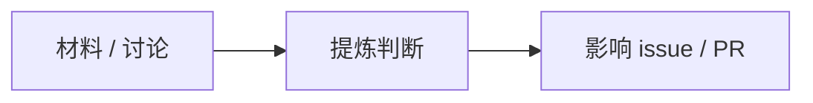

## 探索记录

**状态信号**：`exploration`

**📌 一句话**：
[这次探索形成了什么判断]

## 来龙去脉图

## 人话内容

- 确认了什么：
- 为什么重要：
- 影响哪里：

## 你要拍的板 + 我的推荐

| 问题 | 我的推荐 |
|---|---|
| 是否采纳这个判断？ | 我建议按推荐，除非来源材料有误。 |

## 🔑 黑话小词典
- 探索回写：只记录判断，不代表任务完成 ｜ exploration = 还在调研，没到 verified

🔧 原始材料

