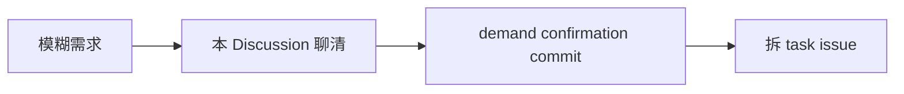

<!-- GitHub Harness · Demand Confirmation · 需求阶段，把模糊想法聊成可执行确认。 -->

> 📌 **一句话**：[这次想做什么，一句大白话]

## 来龙去脉



## 📖 原始需求（Raw Demand）
[把想法倒出来，不用组织]

## 🎯 目标用户（Target User）
[谁用，在什么场景下用]

## 🎯 第一版目标（First Version Goal）
[第一版做到哪算成功，一句话]

## 📐 范围边界
- ✅ In scope：…
- 🚫 Out of scope：…

## ✅ 验收标准（Acceptance Standard）
[做完什么样算交付，可机械验证更好]

## ❓ 开放问题（Open Questions）
- …

## 你要拍的板 + 我的推荐

> [!TIP]
> 我的推荐：[我建议 X，因为 Y]，可回「按推荐」。

---

## 📝 Demand Confirmation Commit
Discussion 结尾让 AI 把确认结果写成下面这段（贴回 commit / 留底）：

```markdown
- Target user:
- First version goal:
- In scope:
- Out of scope:
- Acceptance standard:
- Open questions:
- Suggested issues:
```

> 🔑 **黑话**：Demand confirmation = 把模糊需求冻结成一段可追溯的确认，作为拆 issue 的依据 ｜ Discussion 只聊需求不干活，干活去 task issue

> ⚠️ **边界**：Discussion 不是执行任务。确认后拆成 task issue 再领，别在本 Discussion 直接开工。