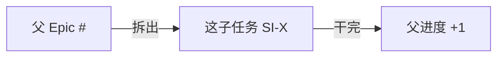

<!-- GitHub Harness · Sub-task · 父 Epic 下可领取的执行单元，跑完 Closes。 -->

🟡  

> [!IMPORTANT]
> **📌 一句话**：[这子任务干啥，一句大白话]
>
> 父 Epic：`Refs #<parent>`。挂成原生 sub-issue（本 issue 页面底部「Sub-issues → Add sub-issue」选父 Epic）。

## 来龙去脉

## 🎯 目标（Outcome）
[做完世界有什么不同]

## 📐 最小竖切（一条分支装得下）
- [ ] [步骤 1]
- [ ] [步骤 2]

## ✅ 成功标准（机械可验）
- [ ] [可机械验证：某命令绿 / 某文件存在]
- [ ] PR 合进 `main` → 本 issue 自动 close → 分支保留

## 🗑️ deletion-spec（拆除说明）
[这次新增的东西将来怎么删 / 回滚]

## 你要拍的板 + 我的推荐

> [!TIP]
> 我的推荐：按本 sub-task 执行；范围不对先回父 Epic 改，再领取。可回「按推荐」。

## 🔑 黑话小词典
- 竖切 = 一条分支能装下的最小完整改动 ｜ Closes = PR 合进 main 后自动关本 issue ｜ deletion-spec = 将来怎么拆掉它