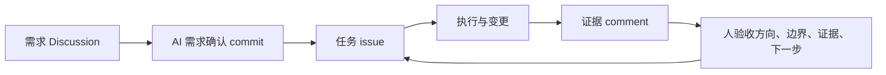

# GitHub Harness Programming Resources

把 AI 工作从聊天窗口里捞出来，放进一个可约束、可追踪、可验收的 GitHub 工作台。

这不是 GitHub 教程，也不是让你背 issue、PR、Discussion 的定义。这里整理的是一套最小可用的工作方法：先把需求聊清楚，再拆成任务，再把证据留在同一个系统里。

## 你可以先复制这三件套

| 文件 | 用途 |
|---|---|
| [`templates/discussion-demand-confirmation.md`](templates/discussion-demand-confirmation.md) | 用 Discussion 把需求聊清楚，最后让 AI 写一份需求确认 commit |
| [`templates/task-issue.md`](templates/task-issue.md) | 把已经确认的需求拆成一个可执行、可验收的任务 |
| [`templates/evidence-comment.md`](templates/evidence-comment.md) | 让 AI 在完成后交代改了什么、证据在哪、还差什么、下一步是什么 |

把这三件套放在一起，就是一个最小的 Harness Programming，也就是一个最小的 Harness Engine。

模型在一个可约束的系统框架上工作，不需要你每一步都反复提醒。它会沿着需求、任务、证据、验收这条 loop 往前跑，人负责看方向、边界和证据。

## 适合什么场景

- 用 AI 做一个小产品、小网站、小工具。
- 用 AI 整理资料库、选题库、研究库。
- 用 AI 推进内容生产、项目管理、学习计划。
- 任何需要多人或多轮 AI 协作、又怕聊天记录散掉的任务。

## 最小 loop

## 仓库内容

| 路径 | 内容 |
|---|---|
| [`docs/minimum-harness-engine.md`](docs/minimum-harness-engine.md) | 最小 Harness Engine 的讲法 |
| [`docs/github-surfaces.md`](docs/github-surfaces.md) | GitHub 里每个 surface 该承担什么 |
| [`docs/resource-map.md`](docs/resource-map.md) | 本期视频资源地图 |
| [`examples/ai-resource-index-demo.md`](examples/ai-resource-index-demo.md) | AI 资料索引站示例 |
| [`diagrams/minimum-harness-engine.mmd`](diagrams/minimum-harness-engine.mmd) | 可复制到 PPT 或 README 的 Mermaid 图 |

## 使用方式

1. 在你的项目里先开一个 Discussion，复制需求确认模板。
2. 把目标、受众、第一版范围、不做什么、验收标准都聊清楚。
3. 让 AI 在 Discussion 末尾写一份需求确认 commit。
4. 根据这份 commit 拆出一个 task issue。
5. AI 执行后，不要只说“做完了”，必须回一条 evidence comment。
6. 你只验四件事：方向有没有跑偏，边界有没有越界，证据能不能看，下一步是不是清楚。

## 公开边界

这个仓库只提供公开视频配套方法、模板和示例，不包含业务材料、账号配置、敏感凭据或个人工作区路径。

## License

MIT
