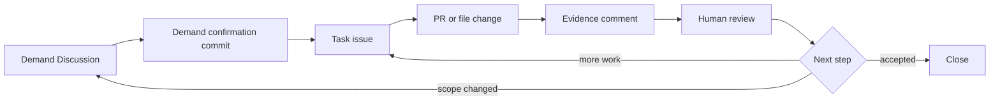

# GitHub Harness Programming Starter Kit

This repo is a copy-and-use starter kit for running AI work through GitHub.

It packages a small version of Kun's GitHub Harness workflow: project instructions, reusable Skills, GitHub templates, and operating checklists. The goal is practical: copy these files into your own repo, let your AI agent read them, and run work through Discussion, issue, PR, and evidence comments instead of scattered chat.

## Quick Start

### 1. Copy the kit into your repo

Copy these folders and files:

| Source | Put it in your repo | Why |
|---|---|---|
| [`prompts/AGENTS.example.md`](prompts/AGENTS.example.md) | `AGENTS.md` | Project-level instructions for your AI agent |
| [`skills/github-harness-workflow/SKILL.md`](skills/github-harness-workflow/SKILL.md) | `.agents/skills/github-harness-workflow/SKILL.md` | The reusable workflow Skill |
| [`skills/github-cognitive-surface-lite/SKILL.md`](skills/github-cognitive-surface-lite/SKILL.md) | `.agents/skills/github-cognitive-surface-lite/SKILL.md` | The issue/comment writing Skill |
| [`templates/`](templates/) | `.github/` or your docs folder | Discussion, issue, PR, and evidence templates |
| [`checklists/adoption-checklist.md`](checklists/adoption-checklist.md) | `docs/github-harness-checklist.md` | Setup checklist |

You do not need to copy every file on day one. Start with `AGENTS.md`, the workflow Skill, and the three templates: demand Discussion, task issue, evidence comment.

### 2. Ask your AI agent to read the instructions

Use this prompt:

```text
Read AGENTS.md and .agents/skills/github-harness-workflow/SKILL.md.
Then help me run this repo through the GitHub Harness workflow.
Do not start implementation until we have a demand Discussion or a task issue.
```

### 3. Open the first demand Discussion

Use [`templates/discussion-demand-confirmation.md`](templates/discussion-demand-confirmation.md).

The Discussion is where requirements get clarified. It should end with an AI-written demand confirmation commit:

```markdown
## Demand confirmation commit

- Target user:
- First version goal:
- In scope:
- Out of scope:
- Acceptance standard:
- Open questions:
- Suggested issues:
```

### 4. Split one task issue

Use [`templates/task-issue.md`](templates/task-issue.md).

The issue should be narrow enough that an AI agent can execute it, produce evidence, and stop for review.

### 5. Require an evidence comment

Use [`templates/evidence-comment.md`](templates/evidence-comment.md).

The agent must say what changed, where the evidence is, what is not done, and what should happen next.

## What This Kit Is



GitHub becomes the control plane. The AI agent works inside a system where requirements, tasks, evidence, and review are linked.

## Repository Map

| Path | What it gives you |
|---|---|
| [`docs/how-it-works.md`](docs/how-it-works.md) | The GitHub Harness model |
| [`docs/adoption-guide.md`](docs/adoption-guide.md) | How to install this kit in another repo |
| [`docs/surface-map.md`](docs/surface-map.md) | What Discussion, issue, PR, comment, and board each do |
| [`prompts/`](prompts/) | Public project instruction examples |
| [`skills/`](skills/) | Copyable Skill files for AI agents |
| [`workflows/`](workflows/) | Step-by-step operating loops |
| [`templates/`](templates/) | Demand, task, PR, evidence, and review templates |
| [`checklists/`](checklists/) | Adoption and boundary checks |
| [`examples/`](examples/) | A small example project using the workflow |

## What To Copy First

If you want the smallest useful setup:

1. `prompts/AGENTS.example.md`
2. `skills/github-harness-workflow/SKILL.md`
3. `templates/discussion-demand-confirmation.md`
4. `templates/task-issue.md`
5. `templates/evidence-comment.md`

That is enough to run the first loop.

## Boundary

This is a public starter kit. It contains reusable workflow instructions, templates, and examples. It does not contain private project material, credentials, personal workspace paths, or account-specific automation.

## License

MIT
