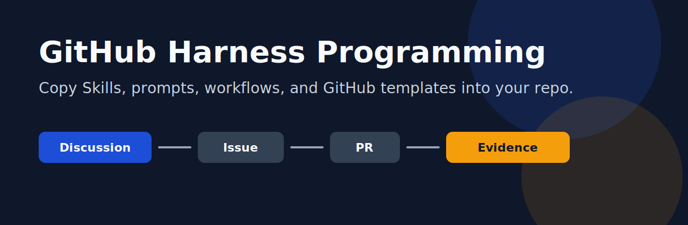
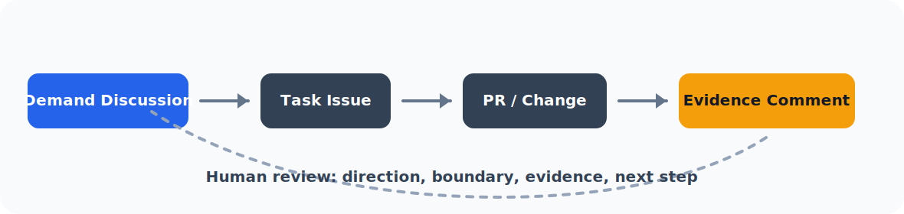
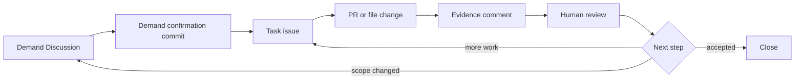

# GitHub Harness Programming Starter Kit

[English](README.en.md) · [采用指南](docs/adoption-guide.md) · [工作流说明](docs/how-it-works.md) · [公开边界](docs/public-boundary.md)




这个仓库是一个可以直接拿走用的 GitHub Harness starter kit。

它整理的是一套可复制到你自己仓库里的 Agent 工作控制面：项目提示词、Skill、GitHub templates、workflow、checklist 和 demo。你复制进去以后，就可以让 AI agent 按 Discussion -> issue -> PR / evidence comment -> review 的方式推进项目。

## 适合谁

| 你现在的情况 | 这个仓库提供什么 |
|---|---|
| AI 对话太散，任务一长就找不到上下文 | 把需求、任务、证据和验收放进 GitHub |
| 想让 AI 不只是聊天，而是持续推进项目 | `github-harness-workflow` Skill |
| 想直接复用一套 GitHub issue / PR / comment 模板 | `.github/` 和 `templates/` |
| 想给自己的项目加一份 Agent 项目说明 | `prompts/AGENTS.example.md` |
| 想先跑一个最小闭环 | demand Discussion -> task issue -> evidence comment |

## 5 分钟 Quick Start

### 1. 复制最小文件

| 从本仓复制 | 放到你的仓库 | 作用 |
|---|---|---|
| [`prompts/AGENTS.example.md`](prompts/AGENTS.example.md) | `AGENTS.md` | 让 AI 知道项目采用 GitHub Harness |
| [`skills/github-harness-workflow/SKILL.md`](skills/github-harness-workflow/SKILL.md) | `.agents/skills/github-harness-workflow/SKILL.md` | 让 AI 按 demand -> task -> evidence 工作 |
| [`skills/github-cognitive-surface-lite/SKILL.md`](skills/github-cognitive-surface-lite/SKILL.md) | `.agents/skills/github-cognitive-surface-lite/SKILL.md` | 让 AI 写清楚 issue / PR / comment |
| [`templates/discussion-demand-confirmation.md`](templates/discussion-demand-confirmation.md) | `.github/DISCUSSION_TEMPLATE/demand-confirmation.md` | 需求确认 Discussion |
| [`templates/task-issue.md`](templates/task-issue.md) | `.github/ISSUE_TEMPLATE/task.md` | 可执行任务 issue |
| [`templates/evidence-comment.md`](templates/evidence-comment.md) | `.github/COMMENT_TEMPLATE/evidence-comment.md` | 完成证据 comment |

### 2. 让 AI 读取项目说明

把这段发给你的 AI agent：

```text
Read AGENTS.md and .agents/skills/github-harness-workflow/SKILL.md.
Then help me run this repo through the GitHub Harness workflow.
Do not start implementation until we have a demand Discussion or a task issue.
```

### 3. 开第一条 Demand Discussion

用 [`templates/discussion-demand-confirmation.md`](templates/discussion-demand-confirmation.md) 开一个 Discussion，把需求、目标用户、第一版范围、不做什么、验收标准都聊清楚。

Discussion 结尾让 AI 写：

```markdown
## Demand confirmation commit

- Target user:
- First version goal:
- In scope:
- Out of scope:
- Acceptance standard:
- Open questions:
- Suggested issues:
```

### 4. 拆一个 Task Issue

用 [`templates/task-issue.md`](templates/task-issue.md) 把需求确认 commit 拆成一个能执行、能验收的任务。

### 5. 要求 Evidence Comment

AI 完成后必须用 [`templates/evidence-comment.md`](templates/evidence-comment.md) 回写：

- 改了什么；
- 证据在哪里；
- 哪些没做；
- 风险是什么；
- 下一步建议 close、continue、split 还是 return to Discussion。

## 工作流





## 仓库内容

| 路径 | 内容 |
|---|---|
| [`docs/how-it-works.md`](docs/how-it-works.md) | GitHub Harness 的工作方式 |
| [`docs/adoption-guide.md`](docs/adoption-guide.md) | 如何把这套 kit 复制到你的 repo |
| [`docs/surface-map.md`](docs/surface-map.md) | Discussion / issue / PR / comment / board 各自负责什么 |
| [`docs/public-boundary.md`](docs/public-boundary.md) | 公开边界 |
| [`docs/verification.md`](docs/verification.md) | 本仓公开前验证记录 |
| [`prompts/`](prompts/) | 项目级 Agent instructions 示例 |
| [`skills/`](skills/) | 可复制的 Skill 文件 |
| [`workflows/`](workflows/) | 可照着跑的流程 |
| [`templates/`](templates/) | Discussion、issue、PR、evidence、review 模板 |
| [`checklists/`](checklists/) | 采用检查和公开边界检查 |
| [`examples/`](examples/) | AI resource index demo |
| [`assets/`](assets/) | README 视觉资产 |

## 公开边界

这个仓库只包含 public-safe 的 workflow、Skill 示例、prompt 示例、GitHub templates、checklists 和 demo。它不包含私有项目材料、凭据、个人工作区路径、私有 registry、账号专属自动化或未公开素材。

## Star History

[](https://www.star-history.com/#kun-content-lab/github-harness-programming-resources&Date)

## License

MIT
