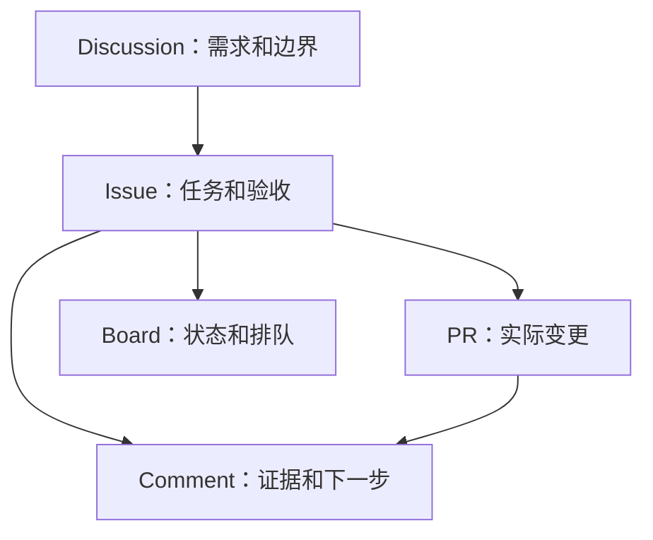

# GitHub Surfaces

GitHub 不是只给程序员写代码用的。它真正有用的地方，是把项目里的不同信息分成不同 surface，让每一类信息待在该待的位置。

## 每个 surface 的职责

| Surface | 适合放什么 | 常见错误 |
|---|---|---|
| Discussion | 需求确认、路线讨论、选择题、还没定下来的问题 | 一上来就拆任务，结果边界没聊清 |
| Issue | 一个可执行任务：目标、范围、验收、证据要求 | 把 issue 当聊天记录，越写越散 |
| Pull Request | 文件变更、代码变更、文档变更的 review 面 | 不写影响范围和验证方式 |
| Comment | 过程证据、完成证据、判断记录、下一步 | 只写“已完成”，没有证据 |
| Project board | 多任务排队、状态流转、优先级 | 单个小任务也强行上复杂看板 |

## 推荐用法

## 四个验收问题

当 AI 交付结果时，人不要只看它说得顺不顺。直接看四件事：

| 问题 | 你要看什么 |
|---|---|
| 方向 | 是否还在解决原始需求 |
| 边界 | 是否做了不该做的东西，或漏了必须做的东西 |
| 证据 | 是否有链接、截图、文件、commit、PR、运行结果 |
| 下一步 | 是 close、继续拆、回到 Discussion，还是需要人拍板 |

## 什么时候需要升级

| 情况 | 升级到什么 |
|---|---|
| 讨论里已经形成稳定需求 | 拆 issue |
| issue 涉及文件变更 | 开 PR |
| 同时有多个 issue | 上 Project board |
| AI 完成但证据不够 | 要求补 evidence comment |
| 方向出现分歧 | 回到 Discussion 重新确认需求 |
