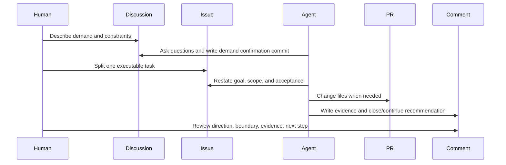

# How GitHub Harness Works

GitHub Harness means using GitHub as the control plane for AI work.

The AI agent is not just chatting with you. It works against durable surfaces:

- Discussion: clarify requirements.
- Issue: define an executable task.
- Pull Request: review concrete file changes.
- Comment: record decisions, evidence, and next steps.
- Board: coordinate multiple tasks when the project grows.

## The Core Loop



## Why This Works

Long AI work fails when everything stays in chat. The agent loses the relationship between the current task, previous decisions, and review evidence.

GitHub fixes that by giving each part of the work a stable place:

| Need | GitHub surface |
|---|---|
| Clarify demand | Discussion |
| Execute one task | Issue |
| Review changes | PR |
| Record proof | Comment |
| Track multiple tasks | Project board |

The important part is not memorizing GitHub features. The important part is building a system where the agent always knows:

1. Where the requirement came from.
2. What the current task boundary is.
3. What evidence it must produce.
4. What the human will review.

## Minimum Harness

The smallest useful setup is:

```text
Demand Discussion -> Task issue -> Evidence comment
```

The Discussion confirms the demand. The issue narrows execution. The evidence comment makes completion reviewable.

Once this loop is stable, add PR templates, boards, labels, and automation.
