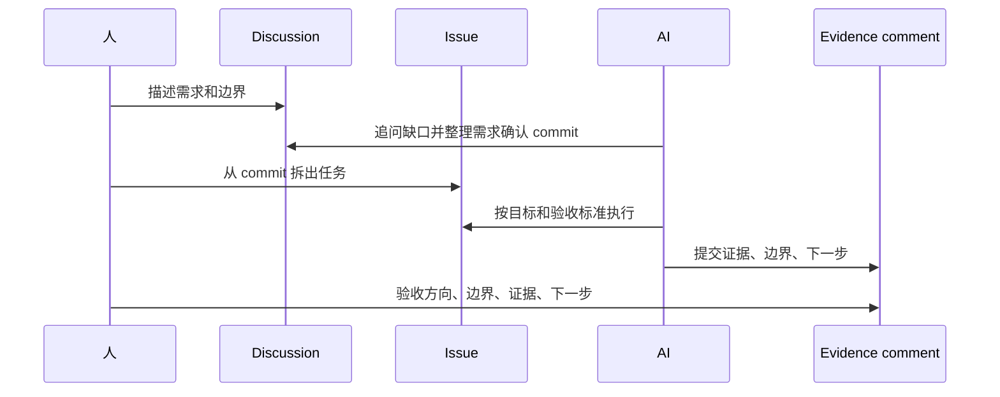

# 最小 Harness Engine

Harness Programming 的重点不是多装一个工具，而是给 AI 一个能持续工作的系统框架。

在聊天窗口里，你每次都要重新解释背景、进度、边界和验收标准。只要任务变长，信息就会碎。GitHub 的价值在于，它把讨论、任务、变更、证据和验收放到同一个可链接的系统里。

最小版本不需要复杂。

## 三个核心对象

| 对象 | 负责什么 | 不负责什么 |
|---|---|---|
| Discussion | 把需求聊清楚，记录为什么做、给谁用、第一版到哪里为止 | 不直接当执行任务 |
| Issue | 承接一个明确任务，写清目标、范围、验收和下一步 | 不放漫长聊天记录 |
| Evidence comment | 完成后交证据，说明改了什么、证据在哪、还差什么 | 不用一句“完成了”代替验收 |

## 为什么 Discussion 要先做需求确认

很多项目一开始会写成：“我要做一个很厉害的网站。”

这种写法对 AI 没有约束。更好的写法是：

> 这个站先服务想入门 AI 工作流的人；第一版只收 20 条高质量资料；只做分类、摘要、来源；不做登录，不做社区，不做推荐算法。

Discussion 的价值就是把这种细节全部摊开。你可以不用太在意结构，因为它本来就是讨论区。重要的是需求要聊透：用户是谁、第一版做什么、暂时不做什么、验收怎么看、哪些问题还没定。

## AI 需求确认 commit

每个需求 Discussion 结尾，都让 AI 写一段需求确认 commit。

它不是 git commit，而是一段明确承诺：

```markdown
## 需求确认 commit

- 目标用户：
- 第一版目标：
- 本轮范围：
- 明确不做：
- 验收标准：
- 仍未确定：
- 建议拆出的 issue：
```

这段内容的作用是把松散讨论压成一个稳定基准。后面拆 issue、写 PR、验收结果，都要回到这个 commit 看有没有跑偏。

## 最小闭环



## 这为什么是 Harness Engine

如果需求、任务、证据三件事都在 GitHub 里，AI 就不是在一条聊天记录里临时发挥，而是在一个可约束系统上工作。

它知道需求从哪里来，知道当前任务边界，知道完成后要交什么证据，也知道人会按什么标准验收。这就是最小的 Harness Engine。
