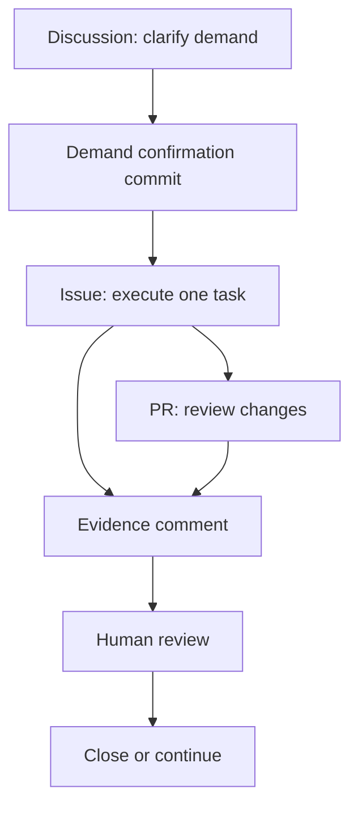

# GitHub Surface Map

Each GitHub surface has one job. The workflow becomes messy when one surface tries to do everything.

| Surface | Job | Good output |
|---|---|---|
| Discussion | Demand confirmation and open questions | A demand confirmation commit |
| Issue | One executable task | Goal, scope, acceptance, evidence requirement. Three layers: `task` (executable), `parent` Epic (control surface, `Refs` only), `sub-task` (slice under parent, `Closes`), `truth-source` (frozen standing brief, never auto-closed) |
| Pull Request | Review file changes | Change map, risk, verification |
| Comment | Evidence, decisions, next steps | Two signals: `completion-comment` (`verified`, ready to close) and `exploration-comment` (`exploration`, judgment only — does not close) |
| Project board | Multi-task status | Ordered work, current state, blocked items |

## Recommended Flow

## Review Questions

When an agent says work is ready, review four things:

| Question | Check |
|---|---|
| Direction | Does this still solve the confirmed demand? |
| Boundary | Did it stay inside the issue scope? |
| Evidence | Can I open the files, PR, command output, screenshot, or link? |
| Next step | Should we close, continue, split, or return to Discussion? |

## Upgrade Rules

| If this happens | Do this |
|---|---|
| Discussion reaches stable demand | Split issue |
| Task changes files | Open PR |
| Agent finishes | Write evidence comment |
| Several issues exist | Add board |
| Scope changes | Return to Discussion |

## Link Discipline (Closes vs Refs)

| PR uses | Effect | Use when |
|---|---|---|
| `Closes #<task/sub>` | Auto-close on merge to `main` | Executable task / sub-task |
| `Refs #<parent/truth-source>` | Link only, never close | Parent Epic / truth-source control surfaces |

The `pr-merged-close-issue.yml` workflow matches `Closes/Fixes/Resolves` (and Chinese 关闭/修复/解决) but **not** `Refs`, so control planes are never auto-closed. `truth-source` issues are guarded even if a PR body mis-writes `Closes`.
