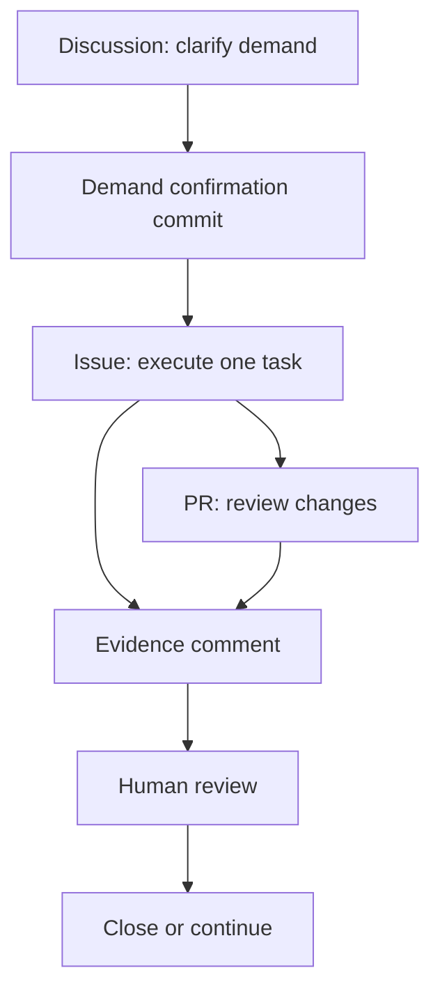

# GitHub Surface Map

Each GitHub surface has one job. The workflow becomes messy when one surface tries to do everything.

| Surface | Job | Good output |
|---|---|---|
| Discussion | Demand confirmation and open questions | A demand confirmation commit |
| Issue | One executable task | Goal, scope, acceptance, evidence requirement |
| Pull Request | Review file changes | Change map, risk, verification |
| Comment | Evidence, decisions, next steps | What changed, where to review, close/continue recommendation |
| Project board | Multi-task status | Ordered work, current state, blocked items |

## Recommended Flow

## Review Questions

When an agent says work is ready, review four things:

| Question | Check |
|---|---|
| Direction | Does this still solve the confirmed demand? |
| Boundary | Did it stay inside the issue scope? |
| Evidence | Can I open the files, PR, command output, screenshot, or link? |
| Next step | Should we close, continue, split, or return to Discussion? |

## Upgrade Rules

| If this happens | Do this |
|---|---|
| Discussion reaches stable demand | Split issue |
| Task changes files | Open PR |
| Agent finishes | Write evidence comment |
| Several issues exist | Add board |
| Scope changes | Return to Discussion |
