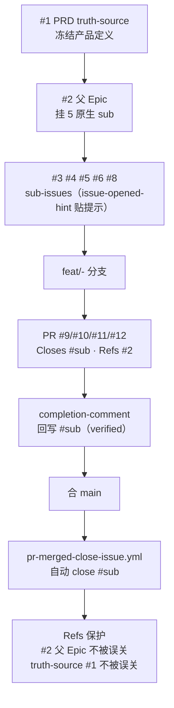

# Living Loop Walkthrough

> 这个 starter kit 仓库**自己用这套跑过一遍**。本 walkthrough 用本仓真实的 issue / PR 还原端到端闭环，照着点链接就能看每一步长啥样。

## 全局时序

## 逐步对应

| 步 | GitHub surface | 本仓真实链接 | 发生了什么 |
|---|---|---|---|
| 1 | Issue · truth-source | [#1](https://github.com/kun-content-lab/github-harness-programming-resources/issues/1) | 冻结 PRD：双轨改造方向、范围、验收。`issue-opened-hint` 自动贴「🔒 冻结勿领取」 |
| 2 | Issue · parent Epic | [#2](https://github.com/kun-content-lab/github-harness-programming-resources/issues/2) | 挂 5 个原生 sub-issue，进度自动 0/5。`issue-opened-hint` 贴「建分支 `feat/2-<slug>`」 |
| 3 | Issue · sub-task | [#3 #4 #5 #6 #8](https://github.com/kun-content-lab/github-harness-programming-resources/issues/2) | 拆出 SI-1~SI-5，每个贴 sub-task 标签 + 领取提示 |
| 4 | Branch | `feat/6-demo-loop` 等 | 每 sub 一条 feat 分支，呼应 hint 提示 |
| 5 | PR | [#9](https://github.com/kun-content-lab/github-harness-programming-resources/pull/9) [#10](https://github.com/kun-content-lab/github-harness-programming-resources/pull/10) [#11](https://github.com/kun-content-lab/github-harness-programming-resources/pull/11) [#12](https://github.com/kun-content-lab/github-harness-programming-resources/pull/12) | body 走 PR 模板：`Closes #sub` + `Refs #2` + 验证矩阵 + review 重点 + deletion-spec |
| 6 | Comment · completion | 见各 issue 评论 | 回写 `verified` completion-comment：改了啥 / 证据在哪 / 没做啥 / 推荐 |
| 7 | Merge | PR merge to main | `gh pr merge --merge`，保留 feat 分支 |
| 8 | Workflow · auto-close | `pr-merged-close-issue.yml` | 合并触发，解析 PR body 的 `Closes #`，自动 close 对应 sub-issue |
| 9 | Workflow · guard | #2 / #1 保持 OPEN | `Refs` 不匹配 close 正则 → 父 Epic 不误关；`truth-source` 标签守护 → PRD 不误关 |

## 三个关键验证点（相对参考实现的修正）

1. **Refs 不误关控制面** — `pr-merged-close-issue.yml` 的正则只匹配 `Closes/Fixes/Resolves`（含中文 `关闭/修复/解决`），**刻意不匹配 `Refs`**。所以 PR body 里 `Refs #2`（父 Epic）从未被自动关闭。本仓 #2 在 4 个 sub 合并后仍 OPEN，证实修正生效。
2. **truth-source 守护** — 即便 PR body 误写 `Closes #1`，workflow 也会跳过带 `truth-source` 标签的 issue 并留言。本仓 #1 始终 OPEN。
3. **中文 PR body 兼容** — workflow 用 Python 正则同时匹配中英文关闭词，本仓所有 PR body 含中文，均正常触发自动 close。

## 三层 issue + 两种 comment 速查

| 层 / 信号 | 标签 | PR 链接动词 | 是否自动 close |
|---|---|---|---|
| `task` | task | `Closes` | 是 |
| `sub-task` | sub-task | `Closes` | 是 |
| `parent` Epic | parent-task | `Refs` | 否（控制面） |
| `truth-source` | truth-source + frozen | `Refs` | 否（冻结守护） |
| `completion-comment` | — | — | 证据回写（verified） |
| `exploration-comment` | — | — | 仅记录判断（exploration，不 close） |

## 抄走者怎么用

1. 复制 `.github/`（模板 + 三个 workflow）+ `skills/` + `prompts/AGENTS.example.md` 到你的 repo
2. 建标签集（见 [`docs/labels.md`](../docs/labels.md)）
3. 开一个 truth-source PRD issue 冻结你想做什么
4. 开 parent Epic 挂原生 sub-issue
5. 领一个 sub → `feat/<n>-<slug>` → PR（`Closes #sub` `Refs #parent`）→ completion-comment → 合 main
6. workflow 自动 close sub，父 Epic / PRD 保留为控制面

> 本仓就是这个流程的真实产物——你正在读的文件，就是 SI-5（#8）走完同一闭环的结果。